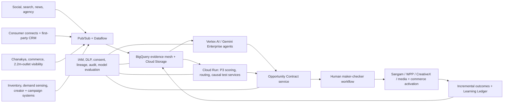

# BrandPulse NEXT

## The Causal Opportunity Router for HUL brand teams

**Working thesis:** HUL does not need another trend dashboard or content copilot. It needs a governed
decision layer that proves an opportunity, assigns it to the right portfolio brand, verifies that
the business can execute it, and converts uncertainty into a pre-registered causal test before the
moment or trend is acted upon.

**Product promise:** From fragmented signal to evidence-backed, human-approved test in under 60
minutes, with every assumption, blocker, decision, and outcome retained in one Opportunity Contract.

**Signature logic:** **Proof x Permission x Preparedness**, implemented as three non-compensating
gates. A viral signal cannot overcome poor brand permission. Strong brand fit cannot overcome stock,
rights, safety, or measurement failure.

---

## 1. Executive decision

Build **BrandPulse NEXT**, not the earlier generic signal-to-content version.

The selected product is a **Causal Opportunity Router** with five actions:

- **Act Now** when the evidence, brand permission, and operational readiness are all strong and the
  moment will expire quickly.
- **Test** when an opportunity is promising but a bounded experiment can resolve material
  uncertainty.
- **Incubate** when a durable opportunity is strategically attractive but needs a product, claim,
  supply, or longer capability lead time.
- **Watch** when evidence is incomplete, conflicting, stale, geographically narrow, or potentially
  manipulated.
- **Ignore** when proof or permission is weak or a non-remediable safety block applies.

The product's atomic object is an **Opportunity Contract**: a versioned record joining the signal,
supporting and contradictory evidence, the competing brands, the chosen route, assumptions, test
design, operational constraints, approval, activation brief, and result. This is what makes the
idea more than a dashboard or a sequence of AI-generated screens.

### Why this is the strongest interpretation of the case

The official case explicitly says that social listening, scraping, agency briefs, consumer data,
and asset requests are fragmented; it says a unified dashboard is not the answer; and it asks for
an AI-first redesign of the brand-management lifecycle. It also asks for a portfolio of products
and one product taken deep through journey, capabilities, agents, architecture, governance, cost,
roadmap, and prototype.

BrandPulse NEXT closes one expensive decision end to end: **Should this portfolio act on this
opportunity, through which brand, in what market, with what evidence and test?**

---

## 2. Competition constraints that shape the answer

| Official constraint | Design implication |
|---|---|
| Product Thinking, 25% | Demonstrate a complete user decision, not a collection of features. |
| Ecosystem Thinking, 20% | Show the product inside a coherent Discover-to-Learn AI portfolio and reuse HUL capabilities. |
| AI and Technical Feasibility, 20% | Separate probabilistic synthesis from deterministic gates and show production architecture. |
| Opportunity Prioritization, 15% | Compare credible product alternatives using the official weights. |
| Business Impact, 15% | Quantify speed, avoided spend, incremental contribution, and adoption gates. |
| Creativity and Prototype, 5% | Submit a memorable working vertical slice, including a guarded failure. |
| Three-slide first-round deck | Put the title/team line on Slide 1; use all three slides for argument and proof. |
| Prototype is mandatory | The public Vercel link must work without a model or live data source. |
| Deadline: 20 August 2026 | Freeze features by 18 August and submit early on 20 August. |
| Team size: three registered students | One person may build, but the registered team still needs three eligible members from the same campus. |

The rulebook also allows third-party/startup partnerships. The proposal should therefore integrate
proven external capabilities where appropriate instead of pretending to rebuild them.

---

## 3. Problem and answer-first storyline

### The user

The primary user is an HUL brand manager who is accountable for spotting and activating consumer
opportunities. Secondary users are a category/portfolio lead, consumer-insights partner,
e-commerce or channel lead, agency partner, and brand/legal checker.

### Job to be done

> When a cultural or consumer signal appears, help me determine whether it is real, which HUL brand
> should own it, whether we can execute it now, and the smallest safe test that will prove
> incremental value before the opportunity expires.

### Root causes

1. **Fragmented truth:** social, search, consumer research, commerce, sales, agency, inventory, and
   creator evidence live in different tools and move at different speeds.
2. **Virality is mistaken for demand:** attention is often treated as proof, even when search,
   purchase, repetition, or geographic diffusion does not follow.
3. **Portfolio ownership is unresolved:** a signal may fit several brands semantically, but only one
   may have credible consumer permission, a differentiated role, and low cannibalization risk.
4. **Operational reality arrives late:** stock, channel coverage, rights, creator availability,
   claim readiness, approvals, and measurement design are checked after enthusiasm has formed.
5. **Learning is not pre-registered:** teams can measure engagement after the fact but may not know
   whether the activation caused incremental behavior or merely followed an already-rising trend.

### Answer

BrandPulse NEXT compiles fragmented evidence into an executable, governed Opportunity Contract. It
does not automate accountability; it compresses the evidence and handoffs needed for a human to
make a high-quality decision.

---

## 4. Why a simpler BrandPulse is not sufficiently unique

The first framing—detect a trend, validate it, generate on-brand content, route it for approval—must
be rejected as the central innovation.

| Existing category | Representative public capability | Why it does not establish our differentiation |
|---|---|---|
| Trend forecasting | Black Swan, Trendalytics, Spate, Tastewise forecast or score trends from multi-source data. | Trend detection and fad-versus-trend prediction are already product categories. |
| Social/consumer intelligence | Brandwatch, Sprinklr, and Quid synthesize large conversation and market datasets. | A better dashboard or insight chat is not a new end-to-end operating model. |
| Signal-to-content | Brand Reflex publicly describes live cultural signal detection, synthetic validation, on-brand content, team approval, and publishing. | This is uncomfortably close to the original idea. |
| Governed creative production | Adobe GenStudio and CreativeX cover creation, brand compliance, performance, and scaled creative standards. | Generating more creative is not HUL's unsolved decision. |
| Causal measurement | Swayable, LiftLab, and Incremental support experimentation or incrementality. | Measurement exists, but it is generally downstream of the portfolio/readiness decision. |

### Defensible novelty claim

The public-market scan found no documented product that combines all five capabilities below into
one governed contract:

1. Cross-source signal proof with visible counter-evidence and decay/half-life.
2. Cross-brand portfolio ownership and cannibalization resolution.
3. Market/channel/SKU operational readiness before the route is chosen.
4. A pre-registered causal micro-experiment created before activation.
5. A learning ledger that compares the original hypothesis, human override, and incremental result.

The correct claim is **“no publicly documented product found with this exact closed loop”**, not
“nobody anywhere has ever built it.” Private enterprise implementations cannot be exhaustively
verified. The originality lies in the combined decision system and HUL data advantage, not in
inventing social listening, generation, or experiment statistics.

---

## 5. The horizontal AI product portfolio

The case asks for ecosystem thinking as well as one deep vertical. Show the following modular
portfolio on Slide 1 and select BrandPulse NEXT using the official weights.

| Brand lifecycle | AI product | Core job | Build/partner posture |
|---|---|---|---|
| Discover | **SenseMesh** | Normalize external signals and HUL consumer/commerce evidence into an evidence graph. | Integrate social listening, search, scraping, consumer-connect repository, and Chanakya. |
| Decide | **BrandPulse NEXT** | Prove, assign, prepare, route, and test an opportunity. | **Build the orchestration and decision IP; selected prototype.** |
| Design | **ConceptForge** | Turn durable Incubate opportunities into product, pack, claim, or proposition concepts. | Integrate HUL Agile Innovation Hub and R&D/claims workflows. |
| Create | **Asset Compiler** | Produce rights-aware, localized channel variants from an approved contract. | Reuse Sangam, WPP/agency systems, generative tools, and CreativeX controls. |
| Activate | **ChannelPilot** | Allocate a bounded test across q-commerce, creators, paid social, and retail cells. | Integrate media, commerce, creator, and campaign systems. |
| Learn | **Learning Ledger** | Retain hypotheses, decisions, overrides, experiments, and incrementality as brand memory. | Shared HUL data product and evaluation layer. |

Shared across all six: brand memory, consent and rights policy, identity and role controls, data
lineage, model evaluation, audit, and human accountability.

### Why BrandPulse NEXT wins prioritization

| Product option | Product 25% | Ecosystem 20% | Feasibility 20% | Priority 15% | Impact 15% | Prototype 5% | Weighted result |
|---|---:|---:|---:|---:|---:|---:|---:|
| Consumer research copilot | 3 | 3 | 5 | 2 | 3 | 4 | 3.30 / 5 |
| Creator/content autopilot | 3 | 3 | 4 | 2 | 3 | 5 | 3.15 / 5 |
| Trend forecast dashboard | 4 | 3 | 4 | 4 | 4 | 4 | 3.80 / 5 |
| **Causal Opportunity Router** | **5** | **5** | **4** | **5** | **5** | **4** | **4.75 / 5** |
| Fully autonomous Brand OS | 3 | 5 | 1 | 2 | 5 | 1 | 3.05 / 5 |

These are team judgments using the official weights, not organizer scores. The selected product is
the only option that addresses the stated workflow gap, exploits HUL-specific data, complements
existing capabilities, and remains demonstrable by one builder in ten days.

---

## 6. The product's core decision model

### 6.1 Proof: Is the opportunity real?

```text
Proof =
  20% persistence
+ 20% independent-source corroboration
+ 20% behavioral progression
+ 15% cohort/geographic diffusion
+ 15% commercial signal
+ 10% freshness and evidence quality
- manipulation, duplication, paid-seeding, and source-concentration penalties
```

- **Persistence:** Is growth sustained across several observation windows rather than one spike?
- **Independent corroboration:** Does it appear in independent source families, not reposts of the
  same event?
- **Behavioral progression:** Does attention progress to search, saves, reviews, baskets, or trial?
- **Diffusion:** Does it spread beyond one creator, cohort, platform, or city?
- **Commercial signal:** Is there category search, basket attachment, q-commerce, or off-take
  movement?
- **Quality/freshness:** Is evidence current, attributable, geographically relevant, and complete?

The interface must show the strongest evidence **and strongest counter-evidence**. When data cannot
support a conclusion, “insufficient evidence” is a valid, positive output.

### 6.2 Permission: Should this brand own it?

```text
Permission =
  25% brand meaning and purpose fit
+ 20% priority-audience overlap
+ 15% distinctive asset/campaign fit
+ 15% historical credibility in the territory
+ 15% portfolio distinctiveness
+ 10% cultural, claims, and safety fit
- portfolio conflict and opportunism penalties
```

This score is run for at least three candidate brands. A model may draft an explanation, but
configured brand rules, evidence, and policy own the score and blockers.

### 6.3 Preparedness: Can the business act here and now?

```text
Preparedness =
  20% product and claim availability
+ 25% inventory and service level in target cells
+ 15% channel coverage
+ 15% creator/agency readiness
+ 15% asset, rights, legal, and approval SLA
+ 10% measurement readiness
```

This is the HUL-specific moat. A public trend tool cannot know that the best-fit SKU is out of stock
in target PIN-code clusters, that a creator's rights window is unavailable, or that two brands are
already claiming the same territory.

### 6.4 Non-compensating route policy

`Opportunity Readiness = min(Proof, Permission, Preparedness)`

| Route | Illustrative rule | Product action |
|---|---|---|
| Act Now | Live moment, useful life no more than 72 hours, Proof >=75, Permission >=80, Preparedness >=80, no blocker | Recommend a rights-safe rapid activation package with a small measurement holdout; activation still requires human approval. |
| Test | Proof 55-74 or Preparedness 55-79, Permission >=70, no mandatory blocker | Pre-register a bounded Causal Sprint. |
| Incubate | Durable trend, strong Proof and Permission, but product/claim/supply lead time is long | Send an evidence-backed concept opportunity to ConceptForge/R&D. |
| Watch | Proof 35-54, conflicting/stale/geographically narrow evidence | Specify the next evidence and a review trigger/date. |
| Ignore | Proof <35, Permission <40, manipulation risk, or non-remediable safety block | Record why it was rejected so the same noise is not repeatedly researched. |

The thresholds are prototype assumptions and must be labeled as such. Their value is inspectability,
not false scientific precision.

### 6.5 Hard blockers

No numeric score can override:

- prohibited or unsupported product claim;
- unlicensed talent, sports, music, footage, or distinctive asset;
- harmful, discriminatory, unsafe, or disclosure-deficient creative;
- expired useful window;
- inadequate stock/service for the proposed scope;
- missing treatment/comparison cells or non-comparable experiment design;
- absent accountable human approval;
- a model response that fails schema or provenance checks.

---

## 7. Five-screen prototype

### Screen 1: Pulse Board

The user sees two or three Opportunity Cards rather than a feed of trends. Each card shows signal
class, useful-life countdown, evidence coverage, P3 weakest link, recommended route, and whether the
data is public, synthetic, inferred, or assumed.

**Show:** one urgent moment, one durable shift, and one noisy/blocked signal. The guided demo opens
the urgent moment.

### Screen 2: Opportunity Contract

Show the falsifiable hypothesis, time series, evidence chain, counter-evidence, freshness, geography,
source links, missing evidence, and Proof component calculation. A “Skeptic view” displays the best
alternative explanation.

**Memorable interaction:** move one source-concentration or commerce-evidence assumption and show
the route recalculate. This proves the output is a decision system, not generated prose.

### Screen 3: Portfolio Resolver

Compare three brands side by side on Permission and Preparedness. Show why the semantic best fit may
not be ready. Surface inventory gaps, claim readiness, active campaigns, audience collision, and
cannibalization.

**Memorable interaction:** change the geography from national to four in-stock cities. Preparedness
rises and the route changes from Watch/Incubate to Test.

### Screen 4: Causal Sprint Studio

Create a pre-registered test with:

- one explicit hypothesis;
- treatment and matched comparison cells;
- channel and audience;
- budget cap;
- one primary incremental metric and guardrails;
- fixed measurement window;
- scale, iterate, and kill rules written before activation;
- stock and cell-comparability validation.

The judge can press “Reveal simulated result” only after approval. The result is labeled synthetic
and evaluated against the original rule; the metric cannot be edited after seeing the outcome.

### Screen 5: Human Review, Activation Pack, and Learning Ledger

Show the evidence summary, brand/claim/rights checks, agency/creator instructions, two channel
variants, accountable maker-checker decision, version history, and audit log. Include one unsafe
variant that is blocked and corrected. Close with the original hypothesis, human override if any,
incremental result, and Scale/Iterate/Kill decision.

---

## 8. Recommended demonstration scenarios

### Hero scenario: “Extra-time sweat confidence” live moment

Use a **clearly synthetic** event inspired by the case opening, not copyrighted match footage or a
claim that HUL actually ran this activation.

- A late-match sports moment creates conversation around performing confidently under heat and
  pressure.
- Public-like snapshots show search/social/news acceleration; synthetic consumer connects reveal
  “confidence despite sweat”; synthetic q-commerce/off-take shows weak but positive category
  progression.
- Compare **Rexona, Dove, and Axe**. Rexona has the strongest permission; a portfolio conflict is
  flagged for Axe; Dove is safer but less distinctive for the moment.
- National readiness is initially weak because synthetic stock/service is insufficient in several
  target clusters and match footage rights are unavailable.
- The system refuses a national Act Now. The user narrows to four in-stock cities and selects
  rights-safe creator-led content; the route becomes **Test**.
- A Causal Sprint uses matched city or creator cells, a capped budget, incremental category search
  or q-commerce conversion as the primary metric, service level as a guardrail, and a fixed scale/
  kill rule.
- One generated variant attempts to reference unlicensed match footage; Brand Guardian blocks it.
- The approved rights-safe variant receives a synthetic result and a Scale/Iterate/Kill decision.

This scenario demonstrates speed, portfolio fit, stock, rights, channel readiness, causal learning,
and human control in one coherent story.

### Secondary card: “Scalp skinification” durable shift

Compare **Dove Hair, Sunsilk, and TRESemmé**. Use persistent search/consumer-language signals but
configure low claim/product readiness. The correct route is **Incubate** or a concept test, not
moment marketing. This proves the router distinguishes a durable strategic shift from an urgent
cultural moment.

### Guarded contrast: single-creator spike

Create an attractive viral signal concentrated in one creator/platform with no search or commerce
progression. Proof falls below threshold, the Skeptic identifies paid seeding or novelty as the
alternative explanation, and the route is **Ignore** or **Watch**. This is the fastest proof that
BrandPulse does not say yes to everything.

### Scope recommendation

Build the detailed path only for the Rexona/Dove/Axe hero. The durable shift and noisy spike need
high-quality summary cards and one evidence view, not full flows. Other category scopes belong in
the roadmap:

| Category | Strong use case | Distinctive readiness data |
|---|---|---|
| Deodorants/personal care | Heat, sport, confidence, cultural moments | Local stock, creator rights, event timing, claims |
| Hair care | Scalp/ingredient routines and premiumization | Formula/claim pipeline, salon/e-commerce cohorts |
| Home care | Monsoon, festival, household hygiene moments | Regional distribution, pack/price, retail and q-commerce service |
| Foods | Recipe, ingredient, occasion, and mini-meal shifts | Recipe safety, regional taste, food claims, basket attachment |

---

## 9. Agents with bounded jobs

| Component | What it does | What it is forbidden to do |
|---|---|---|
| **Evidence Analyst** | Converts evidence records into cited themes and a structured support summary. | Invent sources, alter input metrics, or choose a route. |
| **Skeptic** | Produces the strongest counter-hypothesis, manipulation concerns, and missing evidence. | Average away a blocker or approve action. |
| **Portfolio Resolver** | Drafts the explanation for cross-brand differences. | Set scores, hide conflicts, or select a brand autonomously. |
| **Experiment Architect** | Drafts test rationale and measurement notes. | Change deterministic matching, budget, scale, or kill rules. |
| **Brand Guardian** | Flags semantic brand, inclusion, rights, and claims concerns for review. | Publish content or override exact policy checks. |

The orchestration is a fixed state machine, not an open-ended swarm:

```text
idle -> assembling evidence -> challenging -> scoring -> human route review
     -> designing experiment -> checking readiness -> maker approval
     -> approved test -> simulated outcome -> learned

recovery/terminal: insufficient evidence | policy blocked | expired | service degraded
```

Every agent returns a schema-validated object. A timeout, malformed response, or unavailable model
loads a checked-in result and displays “Fallback synthesis”; it cannot bypass a gate.

---

## 10. Exact prototype technology

### Use

| Layer | Tool | Why |
|---|---|---|
| Web application | Next.js App Router + TypeScript | One Vercel-native full-stack repository; strong typing; server-only API routes. |
| UI | Tailwind CSS + shadcn/ui | Fast, reliable component assembly without a custom design system. |
| Workflow | XState 5 | Explicit states, guarded transitions, recovery paths, and testable human approvals. |
| Schemas | Zod + JSON Schema | Reject malformed model or fixture data before it reaches decisions. |
| AI | Vercel AI SDK + `@ai-sdk/google` + `gemini-3.6-flash` | Structured synthesis with a provider-neutral interface and a current free tier for public/synthetic data. |
| Charts | Recharts | Lightweight evidence and result charts. |
| Prototype storage | Bundled JSON/JSONL fixtures + browser `localStorage` | No database/network dependency in the judged path. |
| Tests | Vitest + React Testing Library + Playwright | Unit gate tests, integration safeguards, and the deployed user journey. |
| Hosting | Vercel | Public link, preview deployments, and simple Next.js hosting. |
| Development | Codex, Claude Code, Cursor, GitHub | Parallel assistance for implementation/review, with one person retaining architectural control. |

Use current stable versions and pin the lockfile on Day 1. As of 6 August 2026, the recommended
prototype model is `gemini-3.6-flash`; configure it through `BRANDPULSE_MODEL` and recheck the
official model page on build day rather than hard-coding it.

### Do not use in the first-round build

- a custom model or fine-tuning;
- a vector database merely to appear “enterprise”;
- live scraping in the critical path;
- automated media buying or social publishing;
- authentication or multi-user collaboration;
- a hosted database unless the static prototype is already complete;
- an autonomous agent framework that can loop or take unbounded actions.

### Demo modes

- `static`: all evidence, explanations, and variants come from versioned fixtures.
- `hybrid`: the app attempts a server-side structured model call with an eight-second timeout, then
  loads the same typed fallback.

The guided demo should default to `static` or a rehearsed `hybrid` mode. Live AI is not what earns
technical feasibility; trustworthy system behavior does.

### Important subscription note

Codex Plus/ChatGPT subscriptions and Claude Pro do not include general runtime API quota. The
prototype can cost zero in static mode. If live synthesis is used, create a separate API key and
use only public/synthetic inputs; Gemini currently documents a free tier, but pricing and data-use
terms must be checked before deployment.

---

## 11. Data to make and how HUL would replace it

### Prototype fixtures

| File | Essential fields | Production replacement |
|---|---|---|
| `signals.json` | timestamp, source family, topic, geography, volume/growth, source link, synthetic flag | Social listening, scraping, search, news, agency inputs |
| `consumer-connects.jsonl` | synthetic interview ID, date, cohort, verbatim, theme, consent scope | HUL consumer-connect repository and first-party CRM |
| `commerce-offtake.json` | date, PIN-code cluster, channel, SKU, units, search index, out-of-stock rate, basket attachment | Chanakya, e-commerce/q-commerce, distributor/outlet visibility |
| `brand-memory.json` | positioning, audience, claims, taboos, assets, history, active campaigns | Brand strategy, past campaigns, research, claims/legal repositories |
| `inventory.json` | SKU, cluster, days of cover, service level, timestamp | Demand sensing, supply, distributor, retailer, and channel systems |
| `influencers.json` | aggregate creator profile, audience, category, geography, safety, availability, cost | HUL/agency creator roster |
| `precomputed-synthesis.json` | typed agent outputs for both scenarios | Vertex AI/Gemini Enterprise runtime with retrieval and evaluation |

The launch transcript mentions approximately 2.2 million-outlet visibility, 25,000 consumer
connects, millions of first-party records, and a 50,000-plus influencer roster. HUL's public
FY2024-25 page separately reports 12,000-plus influencers. Treat that numerical discrepancy
explicitly: do not place an influencer count on a slide unless the team verifies the intended
source/date; simply say **“HUL's existing influencer roster.”**

### Evidence labels

Every record and chart must use one of four visible labels:

- **Public observation:** cited URL and capture date.
- **Synthetic HUL-like data:** invented aggregate records used to demonstrate integration.
- **Model inference:** a structured interpretation, never a source.
- **Business assumption:** an editable threshold, cost, or policy chosen by the team.

### Public data collection

Capture small, dated snapshots rather than live dependencies:

- Google Trends exports or screenshots for search direction;
- YouTube Data API or manual public-comment samples within platform terms;
- GDELT or reputable news links for event diffusion;
- public weather/event calendar when relevant;
- HUL annual reports and official product/brand pages for category and capability context.

Do not collect usernames, profile-level identifiers, private groups, or individual targeting data.

---

## 12. Production architecture for HUL



### What BrandPulse owns

- Opportunity Contract schema and evidence lineage.
- P3 gate configuration and route policy.
- Portfolio conflict and readiness resolution.
- Causal Sprint pre-registration and evaluation.
- Human decision history, overrides, and learning loop.

### What BrandPulse integrates

- HUL's existing social listening, consumer repository, Chanakya, Sangam, demand sensing, creator
  roster, media/commerce systems, and agency workflow.
- Enterprise identity, consent, legal, rights, and model assurance.
- CreativeX or equivalent for scaled creative compliance.

This positioning is essential in Q&A: BrandPulse is the missing **decision orchestration and
learning layer**, not an attempt to replace HUL's data estate.

---

## 13. Ten-day build plan

| Day | Build | Research/submission | Exit test |
|---:|---|---|---|
| 1 | Scaffold and pin the stack; define schemas and route state machine. | Freeze hero scenario, brand set, interview list, and three slide headlines. | Static opportunity object validates. |
| 2 | Create two polished scenario fixtures and brand policies. | Conduct two interviews; document competitor gap and P3 assumptions. | Every record shows provenance type. |
| 3 | Implement Proof, Permission, Preparedness, blockers, and routes. | Back-label first 10 signals. | Boundary unit tests pass. |
| 4 | Build Pulse Board and Opportunity Contract. | Conduct two more interviews. | User can explain route and counter-evidence in <3 minutes. |
| 5 | Build Portfolio Resolver and scope/stock interaction. | Refine user quote and current-state process. | Changing geography deterministically changes readiness/route. |
| 6 | Build Causal Sprint, maker-checker, audit, and result evaluator. | Validate experiment with an analytics/marketing senior. | No approval = no activation; thresholds lock before result. |
| 7 | Add structured synthesis, fallback, safe activation pack, and blocked variant. | Conduct final interview and one usability test. | Network/model failure completes same path. |
| 8 | Visual polish, accessibility, Playwright, deploy. | Complete five proxy-user tests; quantify pilot and business case. | Public URL passes full flow and private-window check. |
| 9 | Fix only observed failures. | Finish three slides, record backup demo, hostile Q&A rehearsal. | Slides, product, architecture, and numbers agree. |
| 10 | Feature freeze and backup verification. | Rulebook, citations, links, team eligibility, file size, and timing audit; submit early. | Two devices/networks plus local/static backup pass. |

### Cut order if behind

1. Remove live model calls and keep checked-in typed synthesis.
2. Remove decorative/secondary charts.
3. Reduce the durable-trend scenario to a card and evidence drawer.
4. Remove editable copy generation.

Never cut provenance, counter-evidence, P3 gates, portfolio comparison, a pre-registered causal
test, human approval, the blocked path, or offline/static fallback. Those are the product.

### Safe use of coding assistants

- **Codex:** architecture, implementation, tests, state-machine and contract review, deployment
  debugging.
- **Claude Code:** independent adversarial review, edge cases, copy/UX critique, and refactoring.
- **Cursor:** fast local navigation and small UI edits.
- **Senior engineers:** one architecture review on Day 2 and one deployment/failure-mode review on
  Day 8; avoid open-ended feature feedback after the scope freeze.

Keep one backlog and one source of truth. Do not ask multiple assistants to edit the same files
simultaneously.

---

## 14. Three-slide submission storyboard

### Slide 1 — “HUL has the signals and AI products; the missing layer is the decision contract that turns them into the right portfolio action”

**Visual:** Discover -> Decide -> Design -> Create -> Activate -> Learn portfolio, with BrandPulse
NEXT highlighted. Below it, show the broken current journey and four evidence points: fragmented
systems, virality versus demand, unresolved brand ownership, readiness checked too late.

**Content:** one practitioner quote, one problem statement, and the weighted prioritization inset.
Place title and team name in a narrow top band rather than using a cover slide.

### Slide 2 — “BrandPulse NEXT proves, assigns, prepares, and tests every opportunity before HUL spends or publishes”

**Visual:** one hero screenshot of the Portfolio Resolver/Opportunity Contract. Around it show:

- Proof / Permission / Preparedness and weakest-link logic;
- five routes;
- Opportunity Contract;
- bounded agents versus deterministic gates;
- HUL data sources;
- maker-checker and blocked variant.

Add a QR code or short URL to the public guided demo.

### Slide 3 — “Start with one Personal Care decision; prove speed and incrementality in 12 weeks; scale the contract across the lifecycle”

**Visual:** 12-week pilot roadmap, KPI scorecard, value equation, prototype-to-production architecture,
and top three risks/mitigations.

Avoid cramming screenshots of all five views. One large product moment is stronger than a collage.

---

## 15. Four-minute prototype walkthrough

**0:00-0:25 — Set the decision**

“A sports moment is accelerating, but attention is not demand. Which HUL brand should act, where,
and what do we need to prove before the window closes?” Select the live Opportunity Card.

**0:25-1:05 — Prove the signal**

Show the evidence chain and Skeptic panel. Point to public versus synthetic labels and the strongest
counter-evidence. Do not read every score.

**1:05-1:50 — Resolve the portfolio and readiness**

Compare Rexona, Dove, and Axe. Show that Rexona has permission but national stock/rights readiness
is the weakest link. Change to four in-stock cities and rights-safe content; route becomes Test.

**1:50-2:35 — Pre-register the causal sprint**

Show matched treatment/comparison cells, budget cap, one primary metric, fixed window, scale rule,
kill rule, and service-level guardrail. Explain that the rules are locked before results.

**2:35-3:15 — Govern activation**

Open the pack. The Guardian blocks an unlicensed match-footage variant. Approve the corrected
creator-led version through maker-checker. Show the audit entry.

**3:15-3:45 — Learn**

Reveal a clearly synthetic result and apply the pre-registered Scale/Iterate/Kill rule. Show that
the original evidence, human change, and outcome remain joined.

**3:45-4:00 — Close**

“Trend tools tell HUL what is rising. BrandPulse tells HUL whether, where, through which brand, and
under what causal proof it should act.”

Keep a 90-second fallback recording that shows the same path, but lead with the live deployed app.

---

## 16. Business case, cost, and roadmap

### Value equation

```text
Annual net value =
  captured opportunities x incremental contribution
+ avoided low-value test/media spend
+ decisions x research/briefing hours saved x loaded hourly cost
- platform, data, change, and operating cost
```

### Illustrative scenario—not an HUL forecast

| Assumption | Illustration |
|---|---:|
| Brands in initial scaled scope | 20 |
| Material signal decisions per brand per year | 24 |
| Time saved per decision | 8 hours |
| Loaded cross-functional hour | INR 3,000 |
| Productivity value | INR 1.15 crore |
| Poorly targeted tests redirected/stopped | 24 x INR 10 lakh |
| Avoided/reallocated spend | INR 2.40 crore |
| Successful incremental opportunities | 6 x INR 50 lakh contribution |
| Incremental contribution | INR 3.00 crore |
| **Illustrative gross annual value** | **INR 6.55 crore before run/change cost** |

Every input must be validated in interviews or a pilot. Do not put INR 6.55 crore on the slide as a
promise; show the formula and a range/sensitivity bar. Contribution, not revenue or engagement,
should anchor the value model.

### Prototype cost

- Vercel Hobby and static fixtures: INR 0.
- Optional Gemini free-tier structured calls: INR 0 within current limits; recheck pricing and
  data-use terms.
- Optional domain/design assets: roughly INR 1,000-2,000.
- Consumer ChatGPT/Codex and Claude subscriptions are already sunk team costs but are not runtime API
  entitlement.

### Illustrative HUL pilot envelope

These are planning ranges, not vendor quotes:

- **12 weeks, 3 brands, 2 channels, 8-10 cities or matched PIN-code clusters.**
- Cross-functional squad: product owner, data/ML, full-stack, data engineering, consumer insights,
  media/e-commerce, brand/legal and change support; several are part-time domain roles.
- One-time pilot delivery: roughly **INR 75 lakh-1.25 crore**.
- Incremental cloud/model/monitoring: roughly **INR 5-10 lakh per month**, excluding existing data,
  media, and software licenses.
- Six-to-nine-month category scale: roughly **INR 4-7 crore**, subject to connector reuse, security,
  licenses, and number of brands/markets.

Ranges need validation with HUL architecture and procurement. The competition prototype itself
does not justify a production ROI claim.

### Pilot success and scale gates

| Dimension | Proposed pilot target |
|---|---|
| Decision speed | Median signal-to-approved-test under 60 minutes for eligible moments |
| Recommendation quality | At least 70% expert agreement on Act/Test routes; track calibration, not just accuracy |
| Safety | Zero simulated/live activation passing with a failed mandatory gate |
| Causal discipline | 100% of Test routes have metric/window/scale/kill rules pre-registered |
| Adoption | At least 70% weekly use among pilot brand users by Week 10 |
| Commercial | Positive pooled incremental contribution with confidence/guardrail reporting |
| Learning | Every completed test and human override appears in the ledger |

Scale only if speed, quality, safety, adoption, and incrementality pass together.

### 12-week pilot

- **Weeks 1-2:** select brands/channels/cities; map decisions and controls; approve P3 rules and data
  contracts.
- **Weeks 3-5:** connect read-only evidence sources; calibrate brand memory; replay historical
  opportunities.
- **Weeks 6-9:** run shadow recommendations, then a small number of maker-checker-approved Causal
  Sprints.
- **Weeks 10-11:** assess route precision, process time, user trust, safety, and incrementality.
- **Week 12:** independent review and scale/iterate/stop decision.

No autonomous publishing in the pilot.

---

## 17. Primary research to request now

The user has access to FMCG practitioners; that is the most valuable unavailable source. Ask for
five to eight 25-minute conversations across brand management, category, consumer insights,
agency/social, e-commerce/q-commerce, and marketing analytics. Alumni, seniors, interns, or agency
planners are acceptable proxies if current HUL employees are unavailable.

### Interview script

1. Tell me about the last fast-moving consumer or cultural signal your team considered.
2. What decision had to be made, by whom, and by when?
3. Which systems, reports, agencies, and people were touched in sequence?
4. Where did you wait, redo work, or disagree?
5. What evidence distinguished real demand from social noise?
6. Did more than one brand or proposition plausibly own it? How was that resolved?
7. What operational issue—stock, channel, claim, rights, creator, approval, measurement—arrived
   later than it should have?
8. How did you decide Act, Test, Watch, or Ignore?
9. Was the success metric and stop/scale rule decided before launch?
10. Replay this case through the five-screen prototype. What information would you need before
    approving the test?

Ask permission to paraphrase one quote. Do not request confidential numbers, screenshots, consumer
data, internal logins, or brand strategy files.

### Back-test

- Select 15-20 public signals across moment, emerging shift, durable trend, and fad/noise.
- Freeze snapshots at an early decision date.
- Have two independent reviewers label the appropriate route using only information available then.
- Run P3 and compare route agreement, false Acts, false Ignores, and decisive dimensions.
- Review disagreements; do not tune thresholds using future knowledge without documenting it.

### Usability test

Give five proxy users the hero scenario and ask them to choose a route. Measure:

- time to understand the recommendation;
- whether they can explain the weakest link;
- whether they notice counter-evidence and synthetic labels;
- whether they trust or override the brand choice;
- whether the causal contract feels actionable;
- what would prevent maker-checker approval.

Record a short anonymized evidence table for Slide 1 or 3.

---

## 18. Risks and judge-ready answers

| Likely challenge | Strong response and proof |
|---|---|
| “This is another dashboard.” | Change stock/geography and show the route update; create and lock a causal test; block activation without approval. |
| “Brand Reflex already does this.” | Agree that signal-to-content exists; show portfolio ownership, operational readiness, pre-registered incrementality, and the versioned learning contract. |
| “An LLM cannot judge a trend.” | It does not. The LLM extracts/summarizes; transparent P3 formulas, blockers, and human judgment decide. |
| “You do not have HUL data.” | The prototype uses labeled public/synthetic records; the data contract maps exactly to HUL systems mentioned in the launch. No false integration claim. |
| “Social data is biased/manipulated.” | Independent source families, concentration and duplication penalties, behavioral progression, counter-evidence, and Watch/insufficient-evidence states. |
| “Why will teams trust it?” | Every decision exposes sources, missing evidence, rules, overrides, maker-checker, and a replayable learning history. Validate with practitioner tests. |
| “How do you prove business impact?” | Pre-register matched cells and incremental metrics; use contribution and avoided spend, not post-hoc engagement. |
| “Why not use HUL's existing tools?” | BrandPulse is an orchestration layer that consumes them; it avoids rebuilding consumer chat, creator selection, content generation, or compliance. |
| “Can one person build this?” | Five screens, two snapshots, deterministic TypeScript core, optional AI, no DB/auth/live scraping, static fallback, ten-day cut order. |
| “What happens when the model fails?” | The same typed precomputed output loads; the UI shows degraded mode; no gate or approval is bypassed. |
| “Why not Act Now on every high score?” | Numeric readiness is the minimum of three gates and hard blockers are non-compensating; uncertain value becomes a bounded Test. |

---

## 19. Sources and evidence boundaries

### User-provided primary material

- Official TechTonic Season 8 case study and rulebook.
- Both launch transcript parts and the complete launch video.
- Existing launch analysis in `LAUNCH_TRANSCRIPT_INSIGHTS.md`.

### HUL/Unilever primary sources

- [HUL FY2024-25 consumer highlights](https://hul-performance-highlights.hul.co.in/performance-highlights-fy-2024-2025/consumers.html) — public scale/capability context, including digital media, influencer roster, and Agile Innovation Hub.
- [HUL Integrated Annual Report 2025-26](https://www.hul.co.in/files/annual-report-2025-26.pdf) — current public context for social-first journeys, demand sensing, Sangam, and outlet-level execution.
- [Google Cloud's Unilever customer hub](https://cloud.google.com/customers/featured/unilever) — public cloud and data partnership context.
- [How Unilever uses Google Cloud to optimize marketing](https://cloud.google.com/blog/topics/customers/how-unilever-uses-google-cloud-to-optimize-marketing-campaigns/) — People Data Centres and marketing analytics context.

### Public capability benchmark

- [Brand Reflex](https://brandreflex.ai/)
- [Black Swan Trendscope](https://info.blackswan.com/landing-page)
- [Trendalytics](https://trendalytics.co/)
- [Spate trend prediction](https://www.spate.nyc/features/accurate-trend-prediction)
- [Tastewise Trend Spotlight](https://tastewise.io/blog/how-tastewises-trend-spotlight-empowers-cpgs)
- [Brandwatch Consumer Intelligence](https://www.brandwatch.com/suite/consumer-intelligence/)
- [Sprinklr Smart Insights](https://www.sprinklr.com/products/consumer-intelligence/smart-insights/)
- [Quid](https://www.quid.com/how-quid-works)
- [Adobe GenStudio brand compliance](https://business.adobe.com/products/genstudio/performance-marketing/brand-compliance.html)
- [CreativeX and Unilever](https://www.creativex.com/blog/unilever-turns-to-creativex-to-scale-creative-best-practices-across-the-globe)
- [Swayable](https://www.swayable.com/)
- [LiftLab](https://liftlab.com/platform/incrementality-testing-engine/)
- [Incremental](https://www.incremental.com/)

### Technical primary sources

- [Vercel AI SDK agent documentation](https://ai-sdk.dev/docs/agents)
- [Gemini structured output](https://ai.google.dev/gemini-api/docs/structured-output)
- [Gemini function calling](https://ai.google.dev/gemini-api/docs/generate-content/function-calling)
- [Gemini API pricing](https://ai.google.dev/gemini-api/docs/pricing)
- [XState documentation](https://stately.ai/docs)
- [Supabase semantic search](https://supabase.com/docs/guides/ai/semantic-search) — reference for a later pilot, not required in v1.

Vendor performance claims are not reused as BrandPulse forecasts. Market research supports only the
public capability comparison and bounded novelty statement.

---

## 20. Final definition of a winning first-round submission

- The three slide headlines tell the full argument without speaker notes.
- The horizontal portfolio is coherent, but only BrandPulse NEXT is taken deep.
- The public prototype completes one memorable decision in under four minutes.
- Evidence, counter-evidence, freshness, provenance, and uncertainty are visible.
- Three brands are compared and operational readiness can change the route.
- The causal sprint locks its metric and scale/kill rule before showing a result.
- A policy or rights failure is caught and cannot be overridden by fluent AI text.
- Human maker-checker approval is required and auditable.
- A missing model or network connection produces a useful fallback, not a broken screen.
- All HUL-like data is visibly synthetic; no private data or claimed integration is implied.
- The value equation labels facts, external evidence, primary research, and assumptions.
- The team can explain why this does not duplicate trend tools, Brand Reflex, HUL's consumer
  repository, creator selection, Sangam, or CreativeX.
- The submission satisfies the three-member registration rule even though one member builds the
  prototype.

**Final one-line close:** Trend tools identify what is rising. **BrandPulse NEXT tells HUL whether,
where, through which brand, and under what causal proof it should act.**
